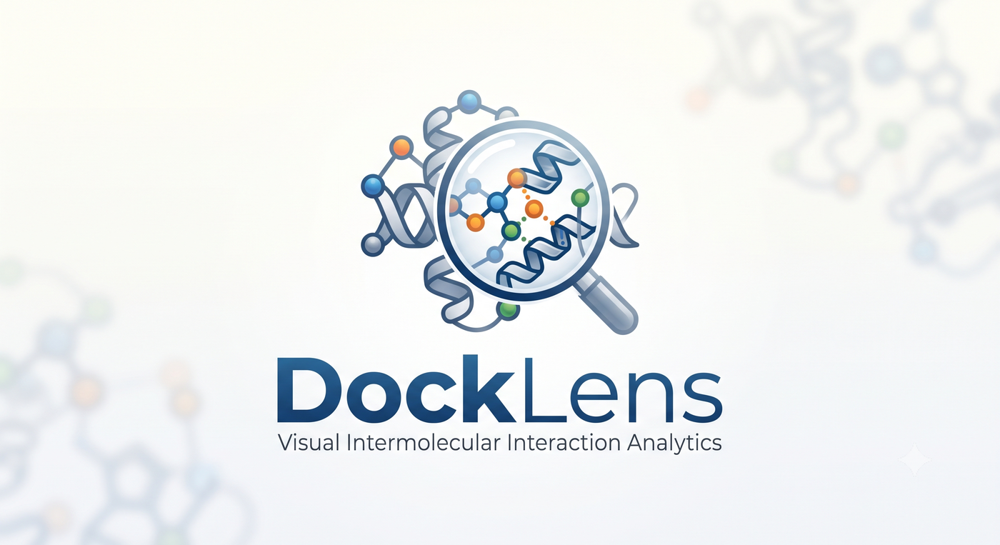

# DockLens



*Visual Intermolecular Interaction Analytics*

Standalone desktop tool (PyQt5) that detects non-covalent intermolecular
interactions in docking poses (`.mol2`, `.pdb`, `.pdbqt`), separates receptor
from ligand automatically, and shows the results in sortable/filterable tables
exportable to CSV / XLSX.

The geometric detection core (`interaction_core.py`) is **ported verbatim** from
the PyMOL plugin `interactions_plugin.py` — same cutoffs, same geometry — so
results are cross-checkable between the two tools. It has **no PyMOL dependency**.

**Inventor:** Adriano Marques Gonçalves — Universidade de Araraquara (UNIARA).

## Interaction types (12)

`hbond`, `carbon_hbond`, `saltbridge`, `pipi` (sandwich/T-shaped), `pication`,
`pialkyl`, `alkyl`, `halogen`, `metal`, `water_bridge`, `pi_sulfur`, `pi_anion`.
Colours use the same colour-blind-safe Okabe-Ito palette as the PyMOL plugin.

## Download (standalone, no Python needed)

Grab the executable for your OS from the [Releases](../../releases) page:

| OS | File | How to run |
|----|------|------------|
| Windows | `DockLens-windows-x86_64.exe` | double-click |
| Linux | `DockLens-linux-x86_64` | `chmod +x DockLens-linux-x86_64 && ./DockLens-linux-x86_64` |

Both are single-file bundles built with PyInstaller — no Python or dependencies
to install. Builds are produced by GitHub Actions (`.github/workflows/build.yml`)
on Windows and Ubuntu runners.

## Run from source

Requirements: Python 3.9+, `numpy`, `pandas`, `openpyxl`, `PyQt5` (no
RDKit/OpenBabel).

```
pip install -r requirements.txt
python -m docklens.app
```

Build your own executable:

```
pip install pyinstaller
pyinstaller --noconfirm --onefile --windowed --name DockLens run_docklens.py
```

## Using the app

1. **Open file(s)** or **Open folder** (recursive scan of `.mol2/.pdb/.pdbqt`).
2. (optional) set key residues — type them (`ASP32 LYS36 SER70`) **or** tick them
   from the checkbox list of the detected protein residues (both stay in sync).
3. Pick the **H-bond criteria** preset (see below).
4. **Run detection**.
5. Sort by clicking a column; filter by interaction type, search text, or
   "key residues only". Edit key residues any time — counts recompute without
   re-running detection.
6. **Export CSV** (two files) or **Export XLSX** (two sheets, type-coloured).
7. **Reset** clears everything to start a new analysis.

## H-bond criteria — DockLens vs. Discovery Studio

DockLens ships two H-bond presets (does not change any other cutoff):

| Preset | Donor···Acceptor | Angle | Result on the FDSVH test pose |
|--------|------------------|-------|-------------------------------|
| **PLIP** (default) | ≤ 4.1 Å | ≥ 100° | 22 H-bonds |
| **Discovery Studio-like** | ≤ 3.5 Å | ≥ 120° | 5 H-bonds |

The default (PLIP) is **deliberately permissive** — it matches the companion
PyMOL plugin so numbers cross-check. Discovery Studio Visualizer uses a stricter
definition (H···A ≈ ≤ 2.5 Å, i.e. D···A ≈ 3.2–3.5 Å, angle ≥ 120°), so it reports
far fewer H-bonds. On the FDSVH pose, 11 of our 22 PLIP H-bonds sit at 3.5–4.0 Å
and 4 above 4.0 Å — genuine but weak/long contacts that DSV does not count. This
is a **definitional difference, not a bug**; use the *Discovery Studio-like*
preset when you want counts aligned with DSV.

## Ligand vs. receptor resolution (fixed priority)

1. mol2 CCDC tags (`CCDC_LIGAND` / `CCDC_AMINOACID`) — source of truth.
2. mol2 `SUBSTRUCTURE` `GROUP` record → that group is the ligand.
3. pdb/pdbqt `HETATM` (excluding water & metals) = ligand; `ATOM` = receptor.
4. Fallback: smallest connected component / smallest chain — **asks for
   confirmation** (never applied silently).
5. Manual override always available.

## Modules

| File | Role |
|------|------|
| `interaction_core.py` | Ported detection core (Atom, Ring, classify, detect_*, CUTOFFS). No PyMOL. |
| `structures.py` | `ParsedPose` schema + covalent-radii bond inference. |
| `parser_mol2.py` / `parser_pdb.py` / `parser_pdbqt.py` | Format readers. |
| `entity_resolver.py` | Ligand/receptor split (priority above). |
| `batch_runner.py` | Input modes, detection driver, Summary/Detail rows, key-residue recompute. |
| `export.py` | CSV / XLSX writers with Okabe-Ito shading. |
| `main_window.py` / `app.py` | PyQt5 UI + entry point. |

## Tests

```
python tests/test_pipeline.py
```

Covers the two attached mol2 acceptance cases, synthetic PDB/PDBQT, key-residue
recompute and CSV/XLSX export.
