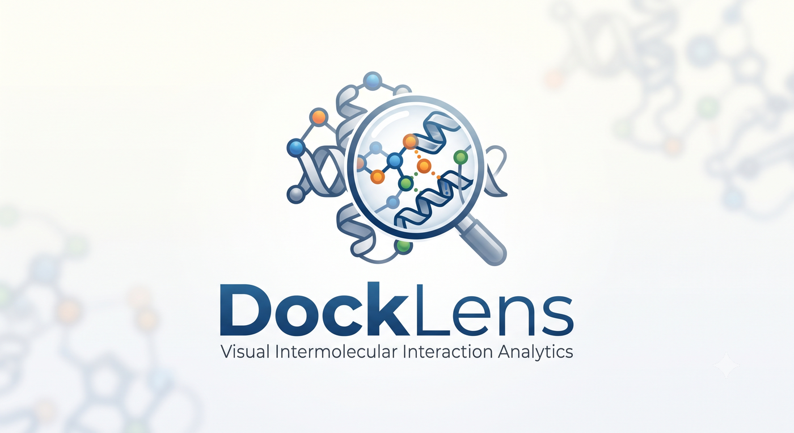

# DockLens



*Visual Intermolecular Interaction Analytics*

Standalone desktop tool (PyQt5) that detects non-covalent intermolecular
interactions in docking poses (`.mol2`, `.pdb`, `.pdbqt`), separates receptor
from ligand automatically, and shows the results in sortable/filterable tables
exportable to CSV / XLSX.

The geometric detection core (`interaction_core.py`) is **ported verbatim** from
the PyMOL plugin `interactions_plugin.py` — same cutoffs, same geometry — so
results are cross-checkable between the two tools. It has **no PyMOL dependency**.

**Inventor:** Adriano Marques Gonçalves — Universidade de Araraquara (UNIARA).

## Interaction types (13)

`hbond`, `carbon_hbond`, `saltbridge`, `pipi` (sandwich/T-shaped), `pication`,
`pialkyl`, `alkyl`, `halogen`, `metal`, `water_bridge`, `pi_sulfur`, `pi_anion`,
`pi_lone_pair`.
Colours use the same colour-blind-safe Okabe-Ito palette as the PyMOL plugin.

## Download (standalone, no Python needed)

Grab the executable for your OS from the [Releases](../../releases) page:

| OS | File | How to run |
|----|------|------------|
| Windows | `DockLens-windows-x86_64.exe` | double-click |
| Linux | `DockLens-linux-x86_64` | `chmod +x DockLens-linux-x86_64 && ./DockLens-linux-x86_64` |

Both are single-file bundles built with PyInstaller — no Python or dependencies
to install. Builds are produced by GitHub Actions (`.github/workflows/build.yml`)
on Windows and Ubuntu runners.

## Run from source

Requirements: Python 3.9+, `numpy`, `pandas`, `openpyxl`, `PyQt5` (no
RDKit/OpenBabel).

```
pip install -r requirements.txt
python -m docklens.app
```

Build your own executable:

```
pip install pyinstaller
pyinstaller --noconfirm --onefile --windowed --name DockLens run_docklens.py
```

## DockingHub integration

DockingHub can open a completed docking directly in DockLens. The applications
remain in separate processes so their Qt runtimes do not conflict. DockingHub
creates a `docklens-launch-v1` JSON manifest that explicitly identifies one
receptor and one multipose docking file, confines both paths to the DockingHub
project and records a SHA-256 digest for each input. DockLens validates the
contract before parsing any structure.

When the paired analysis finishes, DockLens atomically writes the
`docklens-result-v1` path declared by DockingHub. The response includes manifest
and input hashes, parameters, per-pose and per-type counts, interaction detail
and input QC. DockingHub validates that chain before adding the analysis to its
project and consolidated report.

The desktop route is:

```
DockLens.exe --manifest <project>/reports/docklens_launch_<run-id>.json
```

For packaging and diagnostic checks without opening the GUI:

```
DockLens.exe --check-manifest <manifest.json>
```

This prints a compact JSON summary and returns a nonzero exit code when the
manifest, hashes or paired analysis are invalid.

## Using the app

1. **Open file(s)** or **Open folder** (recursive scan of `.mol2/.pdb/.pdbqt`).
2. (optional) set key residues — type them (`SER70; LYS73; GLU166`) **or** tick
   them from the checkbox list of the detected protein residues. Spaces,
   commas, semicolons and line breaks are accepted. DockLens reports invalid,
   unmatched and chain-ambiguous identifiers instead of silently discarding
   them.
3. Pick the **H-bond criteria** preset (see below).
4. Pick the **Analysis view**: Complete preserves every detected interaction;
   Conservative polar/specific is a reversible post-detection view focused on
   more specific polar/pi contacts.
5. **Run detection**.
6. Sort by clicking a column; filter by interaction type, search text, or
   "key residues only". Edit key residues any time — counts recompute without
   re-running detection.
7. **Export CSV** or **Export XLSX**. Choose all interactions or the current
   filtered interactions; every analyzed pose remains in Summary/Matrix, with
   zero counts when no interaction survives the filter. XLSX matrices can use
   interaction counts or binary presence values. "All interactions" always
   exports the complete result; a filtered export records the selected analysis
   view in the Parameters sheet.
8. **Reset** clears everything to start a new analysis.

## H-bond criteria — DockLens and the strict profile

DockLens ships two H-bond profiles:

| Preset | Explicit-H geometry | Chemistry policy |
|--------|---------------------|------------------|
| **PLIP** (default) | D···A ≤ 4.1 Å; legacy angle ≥ 100° | Legacy behavior, retained for reproducibility. |
| **DS-calibrated beta** | Conventional: H···A ≤ 3.1 Å, D–H···A ≥ 90°, H–A–Y ≥ 90°. Carbon H-bond: H···A ≤ 2.5 Å, D–H···A ≥ 120°, H–A–Y ≥ 90°. | Uses retained MOL2 atom/bond types, explicit hydrogens and conservative donor/acceptor rules. |

The default (PLIP) is **deliberately permissive** — it matches the companion
PyMOL plugin so historical numbers remain cross-checkable. The strict profile
also excludes known non-acceptor nitrogens, protonated hydroxyl acceptors and
non-donor carbonyl/carboxylate oxygens. Carbon H-bonds require a polarized
carbon. Its H-bond rows export the participating hydrogen, H···A distance,
D–H···A angle, H–A–Y angle, inference basis and confidence.

The beta profile was calibrated against the matched `FDSVH_sol16` and
`FDSLH_sol26` complexes. It reproduces all intermolecular conventional H-bonds,
carbon H-bonds and the observed lone-pair–π contact in those two references:
8/8 rows for FDSVH and 9/9 for FDSLH. Each Discovery Studio capture also
contains one intraligand H-bond; DockLens intentionally excludes those because
its scope is receptor–ligand interactions. This is an initial calibration, not
a general claim of parity: the profile should be re-evaluated as the reference
corpus grows.

The **Conservative polar/specific** analysis view does not alter detection or
discard the complete result. It hides low-specificity `alkyl`/`pialkyl`
contacts and salt bridges longer than 4.0 Å in the tables and filtered export.
This is an auditable screening aid, not a claim that DockLens reproduces every
proprietary Discovery Studio interaction rule.

## Ligand vs. receptor resolution (fixed priority)

1. mol2 CCDC tags (`CCDC_LIGAND` / `CCDC_AMINOACID`) — source of truth.
2. mol2 `SUBSTRUCTURE` `GROUP` record → that group is the ligand.
3. pdb/pdbqt `HETATM` (excluding water & metals) = ligand; `ATOM` = receptor.
4. Fallback: smallest connected component / smallest chain — **asks for
   confirmation** (never applied silently).
5. Manual override always available.

## XLSX export schema

DockLens exports a versioned, six-sheet workbook:

| Sheet | Contents |
|-------|----------|
| `Summary` | One row per unambiguous pose, with pair counts, distinct key-residue coverage and per-type counts. |
| `Residue Matrix` | One row per pose and grouped columns for residue × interaction type. |
| `Key Residue Coverage` | Ranking-audit view separating raw atomic pairs, distinct conserved residues, conventional H-bond coverage and interaction diversity. |
| `Detail` | Auditable interaction endpoints, pose IDs, atom serials, participating hydrogen, H···A/DHA/HAY geometry and lone-pair–π theta. |
| `Parameters` | DockLens/schema version, preset, cutoffs, export filters and matched/unmatched/ambiguous key-residue identifiers. |
| `Input QC` | Status, resolution method, atom counts, warnings and parse errors. |

The matrix uses full residue identifiers such as `SER70A`, so chains do not
collide. **Count** mode stores the number of interactions; **Presence** mode
stores only `0` or `1`. `Detail` is the canonical source of truth from which the
matrix and filtered summaries are derived.

Each source receives a deterministic `source_id`; every pose/resolution receives
a unique `pose_id`. Water bridges are represented as one semantic
receptor-water-ligand interaction and therefore count once.

`n_key_residue_interactions` is a raw interaction-pair count. It must not be
used as a synonym for residue coverage. `distinct_key_residue_count` and
`key_residue_coverage` are the appropriate fields for rankings based on
conserved positions.

CSV writes `<prefix>_summary.csv`, `<prefix>_key_residue_coverage.csv` and
`<prefix>_detail.csv`. Text controlled by input files is neutralized before
CSV/XLSX writing so it cannot become an Excel formula.

## Modules

| File | Role |
|------|------|
| `interaction_core.py` | Ported detection core (Atom, Ring, classify, detect_*, CUTOFFS). No PyMOL. |
| `structures.py` | `ParsedPose` schema + covalent-radii bond inference. |
| `parser_mol2.py` / `parser_pdb.py` / `parser_pdbqt.py` | Format readers. |
| `entity_resolver.py` | Ligand/receptor split (priority above). |
| `batch_runner.py` | Input modes, detection driver, Summary/Detail rows, key-residue recompute. |
| `integration_manifest.py` | Validated, hashed and project-confined DockingHub launch contract. |
| `integration_result.py` | Atomic `docklens-result-v1` round-trip contract for DockingHub. |
| `results.py` | Immutable schema-v3 result, endpoint, QC and parameter contracts. |
| `result_analysis.py` | Immutable conserved-residue coverage and ranking-audit metrics. |
| `residue_keys.py` | Canonical residue-list parsing, validation and chain-aware matching. |
| `export_views.py` | Pure Summary/Detail/Coverage/Residue Matrix/Parameters/QC transformations. |
| `export.py` | Atomic CSV / XLSX writers with filtering and Okabe-Ito shading. |
| `main_window.py` / `app.py` | PyQt5 UI + entry point. |

## Tests

```
pip install -r requirements-dev.txt
pytest --cov=docklens --cov-branch --cov-fail-under=80
```

Tests use repository-owned synthetic PDB/PDBQT/MOL2 fixtures and cover parsing,
pose identity, immutable key-residue recomputation, water bridges, filtered
exports, formula neutralization, the six-sheet XLSX schema and offscreen UI
flows. No test depends on files outside the repository.
