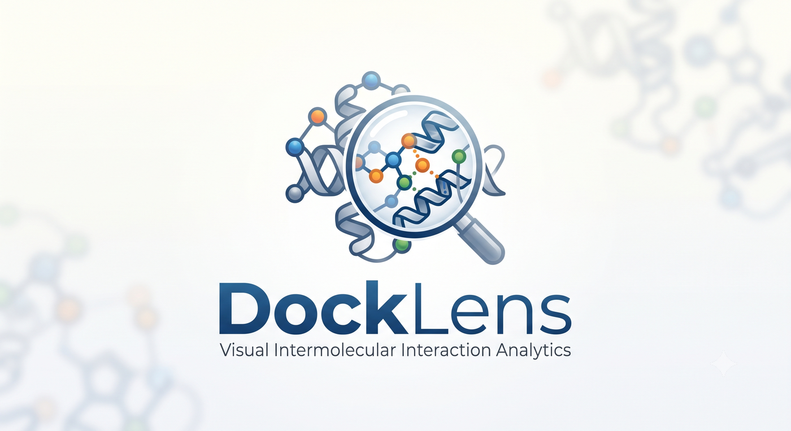

# DockLens



*Visual Intermolecular Interaction Analytics*

Standalone desktop tool (PyQt5) that detects and audits non-covalent
intermolecular interactions in docking poses or saved molecular-dynamics
frames (`.mol2`, `.pdb`, `.pdbqt`). DockLens separates receptor from ligand,
preserves atom-level evidence and presents residue profiles, interaction
fingerprints, comparisons and sortable/filterable tables.

The legacy PLIP profile in `interaction_core.py` preserves historical results.
Three additional scientific profiles are available: native LUNA 0.14 defaults,
DSV-like criteria queried from Discovery Studio Visualizer 2024, and a
conservative LUNA × DSV cross-profile. DockLens has **no PyMOL dependency**.

**Inventor:** Adriano Marques Gonçalves — Universidade de Araraquara (UNIARA).

## Release 1.4.0

Key-residue edits are staged until **Recalculate** is pressed. One application
updates both systems without repeating molecular detection. **Discard changes**
restores the applied selection. Save and export require an applied, consistent
state; pending selections are never silently described as calculated results.

Charts display at most **100 top-ranked ligands**, independently for each system.
Choose mean interaction count per pose or mean distinct fingerprint features
(receptor residue × interaction type) per pose. Zero-contact poses count in the
mean. Ranking measures contact evidence, not binding affinity. Source and ligand
identity distinguish compounds, including multiple compounds in one input file.

The interface, figure annotations and export metadata disclose the ranking,
selected count and any further pose/frame display reduction. Full result tables
are preserved: **Export CSV/XLSX → All interactions** includes every analyzed
ligand and pose, independently of the chart limit. Figure data describe only the
displayed chart selection. Analytical pages prepare their figures on demand.

Pose/frame barcode and similarity views show at most 100 observations, covering
each selected ligand before filling remaining slots in source order. The barcode
displays at most 40 fingerprint features; similarity uses all fingerprint
features. Aggregate frequencies retain all observations of the selected ligands,
including zero-contact poses. These display limits do not delete table data.

## Release 1.3.0

DockLens 1.3 preserves source-native ligand and pose identity from MOL2 through
the interface, analytical tables, Excel exports and reopened projects.

- Paired multipose workflows prefer source `ligand_id` values and retain the
  verbatim `source_molecule_name`, `source_pose_label`, imported docking score
  and `score_type`.
- XLSX exports include a `Ligand Index` sheet and repeat traceability metadata
  in Summary, Detail, Key Residue Coverage, Residue Matrix and Input QC.
- `.docklens` schema 5 stores summaries, details and Input QC as integrity-
  checked NDJSON chunks. Schemas 1–4 remain readable.

Schema 5 keeps the project manifest and methods record small, then stores result
records incrementally under `results/system-a/` and `results/system-b/`:

```text
manifest.json
methods.txt
results/system-a/summaries/part-0001.ndjson
results/system-a/details/part-0001.ndjson
results/system-a/input-qc/part-0001.ndjson
```

Each chunk has a SHA-256 digest, byte count and record count in the manifest;
the reader validates those values while streaming the ZIP entries.

## Release 1.2.0

This release unifies every loading route around an immutable input plan and
adds the explicit external-protein workflow requested for multi-file docking.

- **Protein + ligands** accepts one or more receptor groups. Each group can
  contain multiple ligand/docking files; adding files appends them instead of
  replacing the current selection. Complex files remain available as a
  separate workflow, and System B uses the same plan format.
- The generic runner isolates failures by source and dependent receptor group,
  caches a shared receptor once, rejects receptors with zero or multiple models,
  and records `input_mode`, receptor provenance, group, `source_id` and stable
  `Sxxxxxx:Pxxxx:Rxxx` pose IDs in Input QC and exports.
- MOL2 group resolution no longer places another ligand group into the
  receptor. PDB/PDBQT HETATM ligands are separated by connectivity, while
  combined PDBQT inputs preserve ATOM/HETATM classification.
- `.docklens` projects use schema 4 with explicit plans and continue to read
  schemas 1–4. The methods record now states the input interpretation.
- Windows releases provide both `DockLens-windows-x86_64.exe` (portable) and
  `DockLens-setup-windows-x86_64.exe` (installer). The installer creates the
  application shortcuts and can be removed from Windows Apps.

The publication TIFF export, four scientific profiles and unified color
contract introduced in v1.1 remain part of v1.2.

## Release 1.1.0

This release makes publication-ready figure export a first-class DockLens
workflow and completes the PLIP/LUNA/DSV scientific-profile integration.

- Export the active chart as PNG, SVG, PDF or LZW-compressed TIFF.
- TIFF output uses 600 DPI, records compression and resolution in the
  reproducibility manifest, and preserves the exact chart data as CSV.
- **Export all TIFFs** writes every applicable chart generated by the current
  analysis state, including residue profiles, heatmaps, fingerprints,
  similarity, dynamic states, transitions, comparisons and valid retention or
  confidence views. Each chart receives stable filenames and sidecars, plus a
  collection manifest.
- Individual bundles and TIFF collections use staging plus rollback, so a
  serialization or disk error does not leave a partial publication set.
- The four scientific profiles are shared across DockLens and the PyMOL
  plugin: legacy PLIP, native LUNA defaults, corrected DSV-like criteria and
  the conservative LUNA x DSV union.
- The conservative cross-profile expands representable interaction families
  without inflating counts: shared geometries use the stricter limit,
  semantically equivalent atom pairs are deduplicated, and salt bridges are
  not double-counted as attractive-charge contacts.

See [CHANGELOG.md](CHANGELOG.md) for the complete release record.

## Interaction types (18)

`hbond`, `carbon_hbond`, `saltbridge`, `attractive_charge`,
`charge_repulsion`, `pipi` (sandwich/T-shaped), `pication`,
`pialkyl`, `pi_sigma`, `alkyl`, `halogen`, `metal`, `water_bridge`, `pi_sulfur`,
`pi_anion`, `pi_donor_hbond`, `pi_lone_pair`, `chalcogen`.
Colours use the same colour-blind-safe Okabe-Ito palette as the PyMOL plugin.

## Download (standalone, no Python needed)

Grab the executable for your OS from the [Releases](../../releases) page:

| OS | File | How to run |
|----|------|------------|
| Windows portable | `DockLens-windows-x86_64.exe` | double-click |
| Windows installer | `DockLens-setup-windows-x86_64.exe` | run installer |
| Linux | `DockLens-linux-x86_64` | `chmod +x DockLens-linux-x86_64 && ./DockLens-linux-x86_64` |

The portable files are single-file bundles built with PyInstaller — no Python
or dependencies to install. The Windows installer wraps the same executable
and adds standard Windows shortcuts. Builds are produced by GitHub Actions
(`.github/workflows/build.yml`) on Windows and Ubuntu runners.

## Run from source

Requirements: Python 3.9+, `numpy`, `pandas`, `openpyxl`, `matplotlib`, `Pillow`, `PyQt5`
(no RDKit/OpenBabel).

```
pip install -r requirements.txt
python -m docklens.app
```

Build your own executable:

```
pip install pyinstaller
pyinstaller --noconfirm --onefile --windowed --name DockLens run_docklens.py
```

To build the Windows installer locally, install Inno Setup 6 and run:

```
  iscc /DAppVersion=1.4.0 /DSourceExe=dist\\DockLens.exe /DOutputDir=dist installer\\DockLens.iss
```

## DockingHub integration

DockingHub can open a completed docking directly in DockLens. The applications
remain in separate processes so their Qt runtimes do not conflict. DockingHub
creates a `docklens-launch-v1` JSON manifest that explicitly identifies one
receptor and one multipose docking file, confines both paths to the DockingHub
project and records a SHA-256 digest for each input. DockLens validates the
contract before parsing any structure.

When the paired analysis finishes, DockLens atomically writes the
`docklens-result-v1` path declared by DockingHub. The response includes manifest
and input hashes, parameters, per-pose and per-type counts, interaction detail
and input QC. DockingHub validates that chain before adding the analysis to its
project and consolidated report.

The desktop route is:

```
DockLens.exe --manifest <project>/reports/docklens_launch_<run-id>.json
```

For packaging and diagnostic checks without opening the GUI:

```
DockLens.exe --check-manifest <manifest.json>
```

This prints a compact JSON summary and returns a nonzero exit code when the
manifest, hashes or paired analysis are invalid.

## DockLens 1.0 analytical atlas

The v1 interface has four peer workspaces:

- **Residues:** stacked residue/type bars and a pose/frame barcode. Every
  channel counts at most once per observation × receptor residue × interaction
  type, preventing multiple atom pairs from inflating prevalence or occupancy.
- **Fingerprint:** binary pose/frame fingerprints, Jaccard/Tanimoto similarity,
  an interaction comparison heatmap, deterministic complete-link pose
  families or interaction states, medoid observations, defining contacts,
  population charts and an ordered ribbon. The comparison heatmap can use
  ligand/uploaded-file rows with independently normalized frequency/occupancy,
  or individual pose/frame rows with binary presence.
  Above 300 observations, model training uses a disclosed evenly spaced
  sample; patterns outside the trained threshold remain labeled `OUTLIER`.
- **Compare:** System B minus System A differences with independent
  denominators, plus an explicit docking A → MD B retention analysis
  (`retained`, `intermittent`, `lost`, `gained`). MD comparisons can add
  independent block-bootstrap intervals for the B − A occupancy difference.
- **Tables:** the complete Summary, Key Residue Coverage and atom-level Detail
  views from earlier DockLens versions.

The **DockLens Lens** keeps the selected residue synchronized with its
frequency/occupancy evidence. Docking poses are never described as a temporal
series; switching to molecular dynamics changes labels and enables saved-frame
episode statistics without reinterpreting the raw interaction rows. In MD mode,
Fingerprint also provides a state timeline, observed transition
counts/probabilities and representative frames. By default, frames are treated
as one contiguous series. **Load trajectory map** accepts a CSV with
`observation_id`, `replica_id`, `frame_index` and optional `time_ns`; with that
map, transitions, episodes and resampling preserve declared replica boundaries
and frame gaps. Transitions are descriptive, not a validated Markov model.

MD occupancy intervals use a circular moving-block bootstrap so consecutive
saved frames are resampled together instead of being treated as independent.
The block length, seed, confidence level, number of resamples and any
short-trajectory warning are retained with the plotted rows. Docking data never
uses temporal transition or block-bootstrap terminology.

The **Chart scope — ligand/file** selectors distinguish uploaded ligand
sources by their internal `source_id`, even when different files contain the
same generic ligand label such as `LIG` or `RES1`. Selecting a source
recalculates every analytical chart from all its poses or frames, including
observations with zero surviving interactions. System A and System B have
independent scopes. **All ligands / uploaded files** retains the pooled view;
that view is weighted by observation count, so a ligand with more poses or
frames contributes more to the aggregate.

**Chart labels** is available before detection and selects the human-readable
identity used on analytical axes: detected ligand name, uploaded filename or
pose/frame index. Stable `pose_id` and `source_id` values remain unchanged and
are retained in exported source rows. Repeated names receive a pose/frame
suffix so multipose inputs stay unambiguous.

The **Interaction comparison heatmap** uses all loaded ligand/file groups in
its aggregate mode, even when another chart is focused on a single source.
Each row has its own pose/frame denominator and includes zero-contact
observations. Its individual mode follows the active chart scope. Columns can
represent residue × interaction type or binary presence of any interaction
with a residue; a visible top-feature limit keeps large analyses readable.
A hard cell budget protects the desktop from oversized projects. When it is
reached, rows are selected deterministically across the complete order and the
reduction is stated in the status and reproducibility manifest.

Analyses can be saved as versioned `.docklens` projects. A project stores the
complete immutable result before the Complete/Discovery Studio-like view is
applied, active settings, source SHA-256 digests and a methods record. Cached
result members and an explicit trajectory map are integrity checked when
reopened. Changed or missing external structures are reported and rerunning is
disabled while the verified cached evidence remains inspectable.

Every analytical chart can export a publication bundle containing PNG, SVG,
PDF or LZW-compressed TIFF output, the exact tidy CSV rows used to draw it and
a JSON reproducibility manifest with profile, criteria, denominator and
counting unit. TIFF exports use 600 DPI for publication. **Export all TIFFs**
writes every unique chart available in the current analysis state, its data and
per-chart manifest, plus a collection manifest. The established CSV/XLSX export
remains backward compatible.

The **Complete** and **Discovery Studio-like** views remain visible in the
global profile selector and are applied consistently to charts and tables.

## Using the app

1. Choose **Protein + ligands** for one or more external receptor groups, or
   use **Open complex files** / **Open folder** for combined structures.
   Reopening the protein/ligand dialog appends files within each group.
2. (optional) set key residues — type them (`SER70; LYS73; GLU166`) **or** tick
   them from the checkbox list of the detected protein residues. Spaces,
   commas, semicolons and line breaks are accepted. DockLens reports invalid,
   unmatched and chain-ambiguous identifiers instead of silently discarding
   them.
3. Pick **Chart labels**: ligand name, uploaded filename or pose/frame index.
   This controls presentation only and can be changed later without rerunning.
4. Pick the **Scientific profile** (see below).
5. Pick the **Analysis view**: Complete preserves every detected interaction;
   Discovery Studio-like is a reversible post-detection view that keeps the
   DSV interaction families and rejects salt bridges longer than 4.0 Å.
6. **Run detection**.
7. Explore **Residues**, **Fingerprint** and **Compare**. Choose whether the
   observations represent docking poses or saved molecular-dynamics frames.
   Load a separate System B when a differential or retention analysis is needed.
   Use **Chart scope — ligand/file A** and **System B** to inspect or compare
   individual uploaded ligands without removing other results from the tables.
   Fingerprint contains population, timeline, transition and confidence tabs.
   Set the saved-frame interval before interpreting MD durations. For multiple
   replicas or nonconsecutive saved frames, load the trajectory-map CSV for
   System A and, when comparing MD systems, for System B.
8. Sort by clicking a column; filter by interaction type, search text, or
   "key residues only". Edit key residues, then press **Recalculate** once to
   apply all changes without re-running detection. Pending changes must be
   recalculated or discarded before saving or exporting results.
9. Choose the desired **Export view** in Fingerprint, then use **Export
   figure** to write that figure, its source rows and reproducibility manifest.
10. **Export CSV** or **Export XLSX**. Choose all interactions or the current
   filtered interactions; every analyzed pose remains in Summary/Matrix, with
   zero counts when no interaction survives the filter. XLSX matrices can use
   interaction counts or binary presence values. "All interactions" always
   exports the complete result; a filtered export records the selected analysis
   view in the Parameters sheet.
11. Use **Save project** to preserve cached evidence, settings and methods;
    use **Open project** to resume without redetection.
11. **Reset** clears everything to start a new analysis.

## Scientific interaction profiles

| Profile | Main contract | Default family policy |
|---------|---------------|-----------------------|
| **PLIP** (legacy default) | Historical DockLens/PyMOL cutoffs, including D···A ≤ 4.1 Å and legacy H-bond angle ≥ 100°. | Preserves previous DockLens results. |
| **LUNA 0.14** | Native LUNA geometry: strong H-bond D···A ≤ 3.9 Å and H···A ≤ 2.8 Å; weak H-bond D···A ≤ 4.0 Å and H···A ≤ 3.0 Å; ionic ≤ 6.0 Å; π–π centroid ≤ 6.0 Å; hydrophobic ≤ 4.5 Å; metal ≤ 2.8 Å. | Requires explicit donor hydrogens, as in LUNA's strict donor defaults. Generic proximal/VDW contacts are not enabled by default to avoid atom-pair inflation. |
| **DSV-like** | Discovery Studio 2024 monitor defaults: strong/weak D···A ≤ 3.4/3.8 Å, salt bridge ≤ 4.0 Å, charge ≤ 5.6 Å, cation–π ≤ 5.0 Å and 40°, π–π centroid/closest atom ≤ 6.0/4.5 Å, and native halogen/aromatic criteria. | Chemistry-aware perception with semantic deduplication. |
| **LUNA × DSV conservative** | Union of represented native families, using the smaller maximum distance, larger minimum angle, and all applicable geometry checks where both systems define the family. | Adds representational breadth without loosening shared criteria; duplicate atom combinations collapse to the closest semantic residue/feature pair. |

The LUNA values are tracked from the official
[`config.cfg`](https://raw.githubusercontent.com/keiserlab/LUNA/master/luna/interaction/config.cfg).
They are evaluated by DockLens' dependency-free feature perception; the profile
does not embed LUNA/Open Babel and therefore claims parameter compatibility,
not byte-for-byte LUNA output identity.
The DSV values were queried from the installed `Mdm::NonbondMonitor` API; the
reproducible probe and raw table are in
[`normalizacao_interacoes_intermoleculares`](normalizacao_interacoes_intermoleculares/).
DSV-like means parity with the exposed criteria and represented chemistry, not
a claim to reproduce unpublished proprietary perception logic.

The separate **Complete** / **Discovery Studio-like** analysis view remains a
reversible post-detection filter for older projects. New scientific comparisons
should select the detector profile directly and normally keep the Complete view.

## Ligand vs. receptor resolution (fixed priority)

1. mol2 CCDC tags (`CCDC_LIGAND` / `CCDC_AMINOACID`) — source of truth.
2. mol2 `SUBSTRUCTURE` `GROUP` record → that group is the ligand.
3. pdb/pdbqt `HETATM` (excluding water & metals) = ligand; `ATOM` = receptor.
4. Fallback: smallest connected component / smallest chain — **asks for
   confirmation** (never applied silently).
5. Manual override always available.

## XLSX export schema

DockLens exports a versioned, six-sheet workbook:

| Sheet | Contents |
|-------|----------|
| `Summary` | One row per unambiguous pose, with pair counts, distinct key-residue coverage and per-type counts. |
| `Residue Matrix` | One row per pose and grouped columns for residue × interaction type. |
| `Key Residue Coverage` | Ranking-audit view separating raw atomic pairs, distinct conserved residues, conventional H-bond coverage and interaction diversity. |
| `Detail` | Auditable interaction endpoints, pose IDs, atom serials, participating hydrogen, H···A/DHA/HAY geometry and angular descriptors for π contacts. |
| `Parameters` | DockLens/schema version, preset, cutoffs, export filters and matched/unmatched/ambiguous key-residue identifiers. |
| `Input QC` | Status, resolution method, atom counts, warnings and parse errors. |

The matrix uses full residue identifiers such as `SER70A`, so chains do not
collide. **Count** mode stores the number of interactions; **Presence** mode
stores only `0` or `1`. `Detail` is the canonical source of truth from which the
matrix and filtered summaries are derived.

Each source receives a deterministic `source_id`; every pose/resolution receives
a unique `pose_id`. Water bridges are represented as one semantic
receptor-water-ligand interaction and therefore count once.

`n_key_residue_interactions` is a raw interaction-pair count. It must not be
used as a synonym for residue coverage. `distinct_key_residue_count` and
`key_residue_coverage` are the appropriate fields for rankings based on
conserved positions.

CSV writes `<prefix>_summary.csv`, `<prefix>_key_residue_coverage.csv` and
`<prefix>_detail.csv`. Text controlled by input files is neutralized before
CSV/XLSX writing so it cannot become an Excel formula.

## Modules

| File | Role |
|------|------|
| `interaction_core.py` | Ported detection core (Atom, Ring, classify, detect_*, CUTOFFS). No PyMOL. |
| `structures.py` | `ParsedPose` schema + covalent-radii bond inference. |
| `parser_mol2.py` / `parser_pdb.py` / `parser_pdbqt.py` | Format readers. |
| `entity_resolver.py` | Ligand/receptor split (priority above). |
| `batch_runner.py` | Input modes, detection driver, Summary/Detail rows, key-residue recompute. |
| `integration_manifest.py` | Validated, hashed and project-confined DockingHub launch contract. |
| `integration_result.py` | Atomic `docklens-result-v1` round-trip contract for DockingHub. |
| `results.py` | Immutable schema-v3 result, endpoint, QC and parameter contracts. |
| `result_analysis.py` | Immutable conserved-residue coverage and ranking-audit metrics. |
| `residue_keys.py` | Canonical residue-list parsing, validation and chain-aware matching. |
| `export_views.py` | Pure Summary/Detail/Coverage/Residue Matrix/Parameters/QC transformations. |
| `export.py` | Atomic CSV / XLSX writers with filtering and Okabe-Ito shading. |
| `analytics.py` | Consolidated prevalence/occupancy, fingerprints, similarity, clustering, episodes, comparison and retention. |
| `observation_series.py` | Explicit saved-frame order, time, replica boundaries and gap-aware transitions. |
| `dynamic_states.py` / `dynamic_plotting.py` | Complete-link pose families, MD states, representatives, timelines, observed transitions and publication artifacts. |
| `uncertainty.py` | Circular moving-block bootstrap for MD occupancy and independent B − A differences. |
| `project_session.py` / `project_controller.py` | Integrity-checked `.docklens` projects, cached results, provenance, methods and desktop restoration. |
| `analysis_tasks.py` | Background bootstrap execution without blocking the desktop UI. |
| `plotting.py` / `figure_export.py` | Publication figure builders and atomic figure/data/manifest bundles. |
| `analytics_widgets.py` / `main_window_ui.py` | Responsive analytical workspaces and desktop shell construction. |
| `main_window.py` / `app.py` | Desktop behavior and entry point. |

## Tests

```
pip install -r requirements-dev.txt
pytest --cov=docklens --cov-branch --cov-fail-under=80
```

Tests use repository-owned synthetic PDB/PDBQT/MOL2 fixtures and cover parsing,
pose identity, immutable key-residue recomputation, water bridges, filtered
exports, formula neutralization, the six-sheet XLSX schema and offscreen UI
flows. No test depends on files outside the repository.
